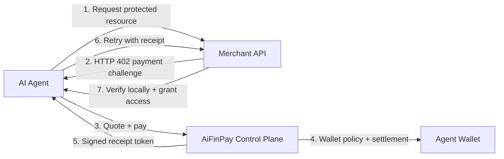
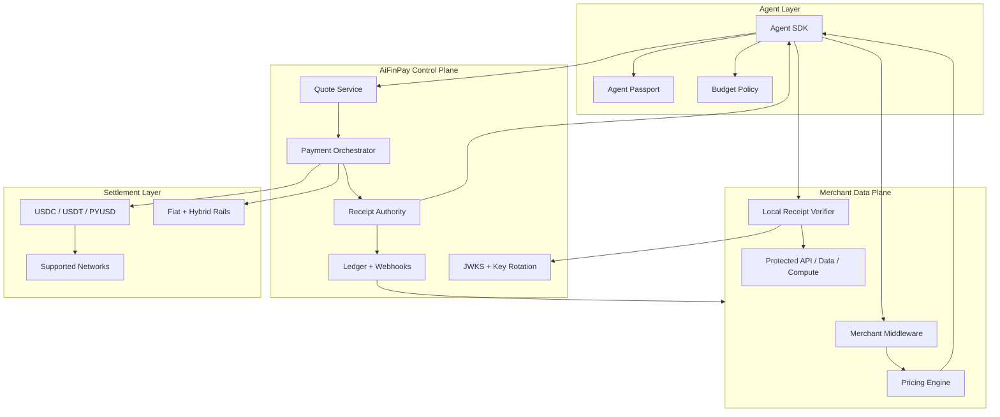
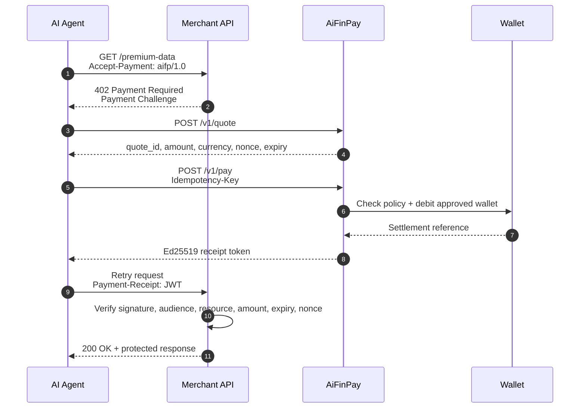

<p align="center">
  
</p>

<h1 align="center">AiFinPay Paywall Protocol</h1>

<p align="center">
  <strong>Payment infrastructure for autonomous AI agents, premium APIs, data products, and machine-to-machine commerce.</strong>
</p>

<p align="center">
  <a href="docs/index.md"></a>
  <a href="LICENSE"></a>
  <a href="docs/aifp/01-AIFP-1-RFC-Payment-Protocol-Specification.md"></a>
  <a href="docs/aifp/08-OpenAPI-3.1-Specification.yaml"></a>
  <a href="ROADMAP.md"></a>
</p>

---

## The Payment Layer For The Agent Economy

AiFinPay Paywall turns HTTP `402 Payment Required` into a production-grade payment handshake for AI agents. A merchant can price any API action, content object, data query, or compute job. An agent can discover the price, pay automatically within policy, receive a cryptographic receipt, and retry the original request without a human checkout screen.



### Why This Exists

| Today | Problem For Agents | AiFinPay |
|---|---|---|
| Ads | Agents do not view or click ads | Per-action machine payments |
| Subscriptions | Agents touch too many sources | Stateless paid receipts scoped to resources |
| Manual API keys | Discovery and onboarding are too slow | Machine-readable `402` challenge |
| Card checkout | Fees exceed tiny machine-action value | Micropayments with wallet policy |
| Bot blocking | Providers lose agent demand | Monetize machine traffic safely |

## How AIFP Relates to x402

x402 established a practical model for using HTTP `402 Payment Required` as a payment interaction
between clients and protected resources. AIFP-1 uses the same HTTP foundation and extends it into a
broader protocol surface for autonomous AI agents, merchant APIs, wallets, receipts, policy controls,
and machine-to-machine commerce. The intent is compatibility and specialization, not replacement.

### Key Differences

- x402 standardized HTTP `402 Payment Required` payment interactions for web resources.
- AIFP adopts the same foundation while expanding the protocol for autonomous AI agents.
- AIFP introduces quote negotiation, receipt lifecycle, wallet policies, merchant-side verification, governance, SDKs, and protocol specifications.
- AIFP targets machine-to-machine commerce where software can discover, purchase, and access digital resources autonomously.
- The two approaches are complementary, and AIFP can coexist with x402-based ecosystems.

---

## Product Surface

| Surface | What It Does | Primary Docs |
|---|---|---|
| Protocol | HTTP 402 challenge, quote, payment, receipt, retry | [AIFP-1 RFC](docs/aifp/01-AIFP-1-RFC-Payment-Protocol-Specification.md) |
| Merchant SDK | Protect routes, price actions, verify receipts locally | [Merchant Integration](docs/aifp/02-Merchant-Integration-Guide.md) |
| Agent SDK | Detect paywalls, quote, pay, retry, enforce budgets | [Agent SDK Spec](docs/aifp/03-AI-Agent-SDK-Specification.md) |
| Wallet Layer | Bind wallets, budgets, assets, rails, settlement policy | [Wallet Guide](docs/wallet.md) |
| Receipt Authority | Ed25519 receipt token issuance and verification | [Security Spec](docs/aifp/04-Security-and-Cryptography-Specification.md) |
| Developer Portal | OpenAPI, JSON schemas, Postman, examples, SDK references | [Docs Portal](docs/index.md) |
| Governance | AIP proposal flow, ecosystem roles, conformance | [AIP Process](docs/aifp/06-AIP-Improvement-Proposal-Process.md) |

---

## Pricing For Agent Actions

| Tier | Starts From | Intended Workload |
|---|---:|---|
| `standard` | `$0.00001` | Simple read, single record, lightweight API request |
| `complex` | `$0.00006` | Search, aggregation, multi-source queries, higher compute |
| `premium` | `$0.00010` | AI inference, GPU workloads, deep analytics, premium data |

AiFinPay charges a **1% protocol fee** on successful transactions. The remaining **99% settles to the merchant**, excluding any applicable payment-network, gas, processor, or settlement costs.

Learn more in [Protocol Economics](docs/economics.md).

---

## Architecture



AiFinPay separates the control plane from the merchant data plane. Merchants verify receipt tokens locally, so access checks remain fast and resilient. The control plane handles quotes, wallet authorization, settlement, receipts, key rotation, and webhooks.

---

## HTTP 402 Sequence



### Payment Challenge Example

```json
{
  "payment_challenge": {
    "version": "1.0",
    "scheme": "aifp",
    "merchant_id": "mrch_9f3a1c2b",
    "resource": "/api/data",
    "pricing_tier": "standard",
    "estimated_amount": "0.00001",
    "currency": "USD",
    "accepted_assets": ["USDC", "USDT", "PYUSD"],
    "accepted_chains": ["polygon", "base", "solana"],
    "quote_endpoint": "https://api.aifinpay.io/v1/quote",
    "nonce": "b7e2c91a",
    "expires_at": "2026-07-01T12:34:56Z"
  }
}
```

---

## Five Minute Start

### Merchant

```bash
npm install @aifinpay/merchant
```

```ts
import { aifpPaywall } from "@aifinpay/merchant";

app.use(aifpPaywall({
  merchantId: "mrch_...",
  pricing: {
    "/api/data": { tier: "standard" },
    "/api/search": { tier: "complex" },
    "/api/inference": { tier: "premium" }
  }
}));
```

### Agent

```bash
npm install @aifinpay/agent
```

```ts
import { AIFPAgent } from "@aifinpay/agent";

const agent = new AIFPAgent({
  apiKey: process.env.AIFP_AGENT_KEY,
  walletId: "wlt_...",
  budget: { dailyUsd: 5 }
});

const response = await agent.fetch("https://merchant.example.com/api/data");
```

### Raw API

```bash
curl https://api.aifinpay.io/v1/quote \
  -H "Authorization: Bearer $AIFP_AGENT_KEY" \
  -H "Content-Type: application/json" \
  -d '{"merchant_id":"mrch_9f3a1c2b","resource":"/api/data","pricing_tier":"standard"}'
```

---

## Documentation Map

| Start Here | Build | Verify | Govern |
|---|---|---|---|
| [Docs Portal](docs/index.md) | [Merchant Guide](docs/merchant.md) | [Security Model](docs/security-model.md) | [AIP Process](docs/aifp/06-AIP-Improvement-Proposal-Process.md) |
| [Quick Start](docs/quickstart/index.md) | [Agent Guide](docs/agent.md) | [Conformance](docs/conformance.md) | [Ecosystem](docs/aifp/14-Ecosystem-and-Governance.md) |
| [Architecture](docs/architecture.md) | [SDKs](sdk/README.md) | [OpenAPI](docs/aifp/08-OpenAPI-3.1-Specification.yaml) | [Roadmap](ROADMAP.md) |
| [Protocol Economics](docs/economics.md) | [Examples](examples/README.md) | [JSON Schemas](docs/aifp/10-JSON-Schemas.md) | [Contributing](CONTRIBUTING.md) |

Every canonical source document lives in [docs/aifp](docs/aifp/README.md). Every important document is reachable within two clicks from this README.

---

## Trust, Security, And Compliance Posture

| Area | Posture |
|---|---|
| Receipt signing | Ed25519 JWT receipts with JWKS key discovery and rotation |
| Replay protection | Nonce, resource binding, receipt expiry, idempotency keys |
| Merchant availability | Local verification; no control-plane call required for every retry |
| Agent safety | Wallet budgets, merchant policy, trust levels, passport metadata |
| Settlement | Stablecoin, fiat, and hybrid settlement model |
| Governance | Public AIP flow for protocol changes |
| Security reporting | Private disclosure through [SECURITY.md](SECURITY.md) |

---

## Release Quality

This repository is organized as a public protocol foundation project:

- Canonical RFC/specification set in `docs/aifp/`.
- Human-readable documentation portal in `docs/`.
- Machine-readable OpenAPI and JSON Schema contracts.
- Postman collection for API exploration.
- SDK design surface for TypeScript, Python, and Go.
- Examples for merchant, agent, wallet, webhook, and raw HTTP flows.
- GitHub issue forms, PR template, workflows, code ownership, roadmap, security, and support policy.

---

## License

Code, examples, schemas, scripts, tests, GitHub workflows, and machine-readable artifacts are licensed under Apache-2.0. Documentation, prose specifications, diagrams, and governance documents are licensed under CC BY 4.0 unless a file states otherwise. See [LICENSE](LICENSE).

---

## Vision

AiFinPay is designed to become a foundational standard for the AI web: a neutral payment layer where autonomous software can discover priced resources, reason about budgets, pay safely, carry reputation, and access the machine-readable economy without subscriptions or human checkout.

