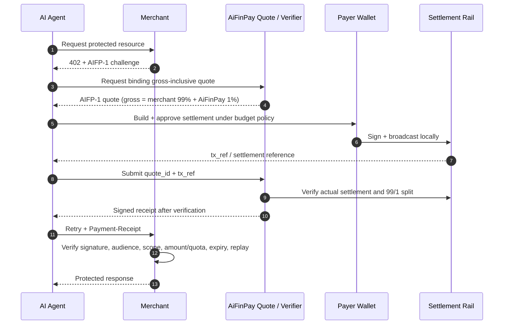

<p align="center">
  
</p>

<h1 align="center">AiFinPay AIFP-1 Protocol</h1>

<p align="center">
  <strong>Merchant AI-traffic and digital-resource monetization for autonomous agents.</strong>
</p>

<p align="center">
  <a href="docs/index.md"></a>
  <a href="LICENSE"></a>
  <a href="docs/aifp/01-AIFP-1-RFC-Payment-Protocol-Specification.md"></a>
  <a href="ROADMAP.md"></a>
</p>

---

## What AIFP-1 Is

AIFP-1 is AiFinPay's draft protocol for monetizing AI-agent access to websites, APIs, MCP servers, content, data, and digital actions. It uses HTTP `402 Payment Required` as the payment-required signal and defines a verifier-first paid-access flow.

```text
request
→ AIFP-1 402 challenge
→ binding quote
→ payer wallet signs + broadcasts settlement locally
→ settlement verifier checks the actual payment
→ receipt issued only after verification
→ agent retries the protected resource
```

AIFP-1 is separate from [AIFP-2](https://github.com/AiFinPay/AIFP-2), AiFinPay's programmable agent-payment protocol. Both may use HTTP `402`; AIFP-2 exposes an x402 v2 compatibility profile while preserving its own protocol identity and `0/0` economics.

## Current Economics

| Route | Standard | Complex | Premium | AiFinPay fee | Creator/referral |
|---|---:|---:|---:|---:|---:|
| **AIFP-1** | `$0.0005` | `$0.002` | `$0.005` | `1%` / `100` bps | `0` bps |
| **AIFP-2 (x402-compatible)** | provider-defined | provider-defined | provider-defined | `0%` | `0%` |

For AIFP-1, the displayed/quoted action price is the **gross amount paid by the agent**. The 1% AiFinPay fee is deducted from that gross amount; it is **not added on top**. The merchant receives 99% before external network or settlement costs, and the creator/referral leg is 0%.

Reference examples:

| Tier | Agent gross payment | Merchant 99% | AiFinPay 1% |
|---|---:|---:|---:|
| Standard | `$0.0005` | `$0.000495` | `$0.000005` |
| Complex | `$0.002` | `$0.00198` | `$0.00002` |
| Premium | `$0.005` | `$0.00495` | `$0.00005` |

Legacy `$0.00001 / $0.00006 / $0.00010` pricing, `100/1` economics, and fee-on-top AIFP-1 interpretations are superseded current-product guidance.

## Core Security Invariants

1. A payable quote must not be issued for a route the active verifier cannot validate.
2. A receipt must not be issued merely because a client supplied a transaction hash.
3. The payer keeps signing local; `/v1/pay` receives the settlement reference, not the private key or recovery phrase.
4. AIFP-1 must use gross-inclusive `100/0` economics: gross payer amount = merchant amount + 1% AiFinPay fee; AIFP-2 must use `0/0`; cross-route fallback fails closed.
5. Monetary comparisons use exact decimals/integer base units with asset-decimal awareness.
6. Replay, duplicate settlement consumption, and idempotency conflicts fail closed.

## Protocol Sequence


```mermaid
sequenceDiagram
    autonumber
    participant A as AI Agent
    participant M as Merchant
    participant P as AiFinPay Quote / Verifier
    participant W as Payer Wallet
    participant R as Settlement Rail

    A->>M: Request protected resource
    M-->>A: 402 + AIFP-1 challenge
    A->>P: Request binding gross-inclusive quote
    P-->>A: AIFP-1 quote (gross = merchant 99% + AiFinPay 1%)
    A->>W: Build + approve settlement under budget policy
    W->>R: Sign + broadcast locally
    R-->>A: tx_ref / settlement reference
    A->>P: Submit quote_id + tx_ref
    P->>R: Verify actual settlement and 99/1 split
    P-->>A: Signed receipt after verification
    A->>M: Retry + Payment-Receipt
    M->>M: Verify signature, audience, scope, amount/quota, expiry, replay
    M-->>A: Protected response
```

## Canonical Documentation

| Surface | Source |
|---|---|
| Normative AIFP-1 behavior | [AIFP-1 RFC](docs/aifp/01-AIFP-1-RFC-Payment-Protocol-Specification.md) |
| Economics | [Protocol Economics](docs/economics.md) |
| Merchant implementation guidance | [Merchant Guide](docs/aifp/02-Merchant-Integration-Guide.md) |
| Agent behavior | [Agent SDK Specification](docs/aifp/03-AI-Agent-SDK-Specification.md) |
| Security model | [Security Specification](docs/aifp/04-Security-and-Cryptography-Specification.md) |
| Machine-readable API | [OpenAPI 3.1](docs/aifp/08-OpenAPI-3.1-Specification.yaml) |
| Object contracts | [JSON Schemas](docs/aifp/10-JSON-Schemas.md) |
| Governance | [AIP Process](docs/aifp/06-AIP-Improvement-Proposal-Process.md) |

## Implementation Status Discipline

This repository is a **draft protocol/specification project**. Documentation, schemas, examples, or a deployed contract do not by themselves prove production readiness.

For a chain/asset route to be described as payment-live, the implementation should have current evidence for canonical source/deployment provenance, the selected economic profile, token decimals, SDK transaction construction, settlement verification, replay/idempotency behavior, appropriate review, and an end-to-end paid flow.

Actual SDK package versions, MCP releases, backend deployment status, and payment-live networks are implementation facts and must be verified from their current repositories/package registries rather than inferred from this protocol repository.

## Related Protocols

- [**AIFP-2**](https://github.com/AiFinPay/AIFP-2): programmable agent-payment protocol with an x402 v2 compatibility profile; current AiFinPay protocol fee profile `0/0`.
- [**AIFP-3**](https://github.com/AiFinPay/AIFP-3): Global Agent Passport for portable agent identity, authorization context, reputation, and wallet bindings.
- **ACP:** experimental agent-to-agent messaging companion; not the AIFP-1 payment wire format.

## License

Code, examples, schemas, scripts, tests, GitHub workflows, and machine-readable artifacts are licensed under Apache-2.0. Documentation and prose specifications are licensed under CC BY 4.0 unless a file states otherwise. See [LICENSE](LICENSE).
