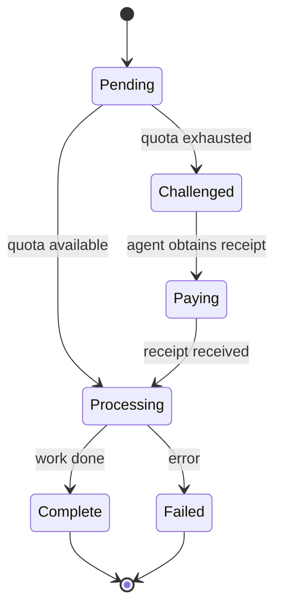

# Agent Communication Protocol (ACP) Specification

**Document:** AIFP-DOC-16  
**Title:** Agent Communication Protocol Specification  
**Category:** Standards Track  
**Status:** Draft Standard  
**Version:** 1.0.0  
**Date:** July 24, 2026  
**Authors:** AiFinPay Protocol Team  
**Contact:** protocol@aifinpay.io · https://aifinpay.io  
**Governed by:** AIFP-1 (Doc 01) — on any conflict, AIFP-1 RFC governs.

> This is **Document 16 of 16** in the official AiFinPay documentation set:
>
> 1. [AIFP-1 — Payment Protocol Specification](./01-AIFP-1-RFC-Payment-Protocol-Specification.md) — the normative standard
> 2. [Merchant Integration Guide](./02-Merchant-Integration-Guide.md)
> 3. [AI Agent SDK Specification](./03-AI-Agent-SDK-Specification.md)
> 4. [Security & Cryptography Specification](./04-Security-and-Cryptography-Specification.md)
> 5. [Whitepaper](./05-Whitepaper.md)
> 6. [AIP Improvement Proposal Process](./06-AIP-Improvement-Proposal-Process.md)
> 7. [Quick Start Guide](./07-Quick-Start-Guide.md)
> 8. [OpenAPI 3.1 Specification](./08-OpenAPI-3.1-Specification.yaml)
> 9. [Postman Collection](./09-Postman-Collection.json)
> 10. [JSON Schemas](./10-JSON-Schemas.md)
> 11. [SDK Reference](./11-SDK-Reference.md)
> 12. [Developer Portal Structure](./12-Developer-Portal-Structure.md)
> 13. [Branding Guidelines](./13-Branding-Guidelines.md)
> 14. [Ecosystem & Governance](./14-Ecosystem-and-Governance.md)
> 15. [Repository Architecture](./15-Repository-Architecture.md)
> 16. **Agent Communication Protocol Specification** *(this document)*
>
> This document defines the agent-to-agent communication layer that
> complements AIFP-1's HTTP/x402 payment layer. Where protocol details
> are summarized, the [AIFP-1 specification](./01-AIFP-1-RFC-Payment-Protocol-Specification.md) governs.

---

## Copyright Notice

Copyright © 2026 AiFinPay, Inc. Licensed under CC BY 4.0.
Reference code is Apache-2.0/MIT.

---

## Table of Contents

1. [Purpose & Scope](#1-purpose--scope)
2. [ACP Message Format](#2-acp-message-format)
3. [Agent Discovery](#3-agent-discovery)
4. [Identity & Authentication](#4-identity--authentication)
5. [ACP Transport](#5-acp-transport)
6. [ACP + Payment Integration](#6-acp--payment-integration)
7. [Cross-Agent Payment Flow](#7-cross-agent-payment-flow)
8. [ACP Error Codes](#8-acp-error-codes)
9. [Security Requirements](#9-security-requirements)
10. [ACP State Machine](#10-acp-state-machine)
11. [Backward Compatibility with HTTP/x402](#11-backward-compatibility-with-httpx402)
12. [Glossary](#12-glossary)
13. [References](#13-references)

---

# 1. Purpose & Scope

## 1.1. Why ACP Exists

AIFP-1 defines the HTTP/x402 payment layer: `402` challenges, quotes,
receipts, and settlement. But AI agents also need to **communicate with
each other** directly — without an HTTP merchant in the middle.

ACP fills that gap. It is the **agent-to-agent communication protocol**
that lets agents:

- Discover other agents and their capabilities
- Send structured requests (tool calls, data queries, compute jobs)
- Receive structured responses (results, errors, payment challenges)
- Pay each other using the same x402 receipt model as HTTP payments
- Delegate work to sub-agents with scoped budgets

## 1.2. Relationship to x402

ACP and x402 are **complementary layers**:

| Layer | Protocol | Purpose |
|---|---|---|
| **HTTP Transport** | x402 / HTTP 402 | Agent → Merchant payment handshake |
| **Agent Transport** | ACP | Agent ↔ Agent structured communication |
| **Payment** | x402 receipts (Ed25519 JWT) | Same receipt format for both layers |

An agent that speaks ACP **also** speaks x402. Payment receipts are
identical in format and verification regardless of whether the request
came via HTTP or ACP.

## 1.3. Design Goals

1. **Agent-native.** Structured messages, not HTTP requests.
2. **Payment-first.** Every ACP exchange can carry a payment challenge
   and resolve it with an x402 receipt.
3. **Transport-agnostic.** ACP works over HTTP, WebSockets, SSE, or
   direct P2P connections.
4. **Identity-bound.** Every message is signed by the sender's
   Agent Passport key.
5. **Budget-aware.** Agents carry and enforce spend limits natively.

---

# 2. ACP Message Format

## 2.1. Envelope

Every ACP message is a JSON object with this structure:

```json
{
  "acp_version": "1.0",
  "message_id": "msg_7f3a9c2e",
  "timestamp": "2026-07-24T12:00:00Z",
  "sender": {
    "agent_id": "agt_4f9a2c7e",
    "passport_id": "pp_2b9f8d1a",
    "signature": "ed25519:Base64UrlSignature"
  },
  "recipient": {
    "agent_id": "agt_8b3c1d5f"
  },
  "type": "request | response | challenge | payment | status",
  "payload": { }
}
```

| Field | Required | Description |
|---|---|---|
| `acp_version` | Yes | Protocol version. MUST be `"1.0"` for AIFP-1. |
| `message_id` | Yes | Unique message identifier. SHOULD be ULID or UUIDv7. |
| `timestamp` | Yes | ISO 8601 timestamp. Used for replay protection. |
| `sender` | Yes | Sender identity with Ed25519 signature over the full message body (excluding `sender.signature`). |
| `recipient` | Conditional | Required for direct messages. Omitted for broadcast/multicast. |
| `type` | Yes | Message type: `request`, `response`, `challenge`, `payment`, `status`. |
| `payload` | Yes | Type-specific payload (see below). |

## 2.2. Request Message

An agent requests work from another agent:

```json
{
  "acp_version": "1.0",
  "message_id": "msg_7f3a9c2e",
  "timestamp": "2026-07-24T12:00:00Z",
  "sender": {
    "agent_id": "agt_4f9a2c7e",
    "passport_id": "pp_2b9f8d1a",
    "signature": "ed25519:..."
  },
  "recipient": { "agent_id": "agt_8b3c1d5f" },
  "type": "request",
  "payload": {
    "action": "search",
    "resource": "/api/company?q=Acme+Corp",
    "pricing_tier": "complex",
    "max_price_usd": "0.005",
    "timeout_seconds": 30,
    "metadata": { "correlation_id": "task_abc123" }
  }
}
```

| Payload Field | Required | Description |
|---|---|---|
| `action` | Yes | The action being requested: `search`, `retrieve`, `compute`, `inference`, or custom. |
| `resource` | Yes | The resource path or query describing the work. |
| `pricing_tier` | Yes | Expected pricing tier: `standard`, `complex`, `premium`. |
| `max_price_usd` | No | Maximum price the sender is willing to pay. If omitted, agent accepts the quoted price. |
| `timeout_seconds` | No | Maximum time to wait for a response. Default 30s. |
| `metadata` | No | Arbitrary key-value pairs for correlation and tracing. |

## 2.3. Challenge Message

The recipient agent requires payment before processing the request:

```json
{
  "acp_version": "1.0",
  "message_id": "msg_9d4e2a1b",
  "timestamp": "2026-07-24T12:00:01Z",
  "sender": {
    "agent_id": "agt_8b3c1d5f",
    "passport_id": "pp_5c3a7e9d",
    "signature": "ed25519:..."
  },
  "recipient": { "agent_id": "agt_4f9a2c7e" },
  "type": "challenge",
  "payload": {
    "in_response_to": "msg_7f3a9c2e",
    "challenge": {
      "version": "1.0",
      "scheme": "x402",
      "quote_endpoint": "https://api.aifinpay.io/v1/quote",
      "merchant_id": "agt_8b3c1d5f",
      "resource": "/api/company?q=Acme+Corp",
      "pricing_tier": "complex",
      "estimated_amount": "0.002",
      "currency": "USD",
      "nonce": "b7e2...c91a",
      "expires_at": "2026-07-24T12:05:00Z"
    }
  }
}
```

| Payload Field | Required | Description |
|---|---|---|
| `in_response_to` | Yes | The `message_id` of the request this challenge responds to. |
| `challenge` | Yes | Standard x402 payment challenge (AIFP-1 §6). Identical to HTTP 402 challenge. |

## 2.4. Payment Message

The sender agent has obtained a receipt and is resubmitting the request:

```json
{
  "acp_version": "1.0",
  "message_id": "msg_3f8b7c4d",
  "timestamp": "2026-07-24T12:00:05Z",
  "sender": {
    "agent_id": "agt_4f9a2c7e",
    "passport_id": "pp_2b9f8d1a",
    "signature": "ed25519:..."
  },
  "recipient": { "agent_id": "agt_8b3c1d5f" },
  "type": "payment",
  "payload": {
    "in_response_to": "msg_9d4e2a1b",
    "original_request": { },
    "receipt": "eyJhbGciOiJFZERTQSIsInR5cCI6IkpXVCIs..."
  }
}
```

| Payload Field | Required | Description |
|---|---|---|
| `in_response_to` | Yes | The `message_id` of the challenge this payment responds to. |
| `original_request` | Yes | The original request payload (echoed from the initial request). |
| `receipt` | Yes | The x402 receipt token (Ed25519-signed JWT). Same format as HTTP `Payment-Receipt`. |

## 2.5. Response Message

The recipient agent returns the result after verifying the receipt:

```json
{
  "acp_version": "1.0",
  "message_id": "msg_5a2d8e3f",
  "timestamp": "2026-07-24T12:00:06Z",
  "sender": {
    "agent_id": "agt_8b3c1d5f",
    "passport_id": "pp_5c3a7e9d",
    "signature": "ed25519:..."
  },
  "recipient": { "agent_id": "agt_4f9a2c7e" },
  "type": "response",
  "payload": {
    "in_response_to": "msg_3f8b7c4d",
    "status": "success",
    "data": { "results": [ { "name": "Acme Corp", "id": "corp_123" } ] },
    "receipt_id": "rcpt_7b3e9f21"
  }
}
```

| Payload Field | Required | Description |
|---|---|---|
| `in_response_to` | Yes | The `message_id` of the payment this response responds to. |
| `status` | Yes | `success`, `error`, `partial`, or `settling`. |
| `data` | Conditional | Result data. Required when `status` is `success` or `partial`. |
| `receipt_id` | Yes | The `receipt_id` from the verified receipt. |
| `error` | Conditional | Error object when `status` is `error`. See §8. |

## 2.6. Status Message

Optional progress notification for long-running requests:

```json
{
  "acp_version": "1.0",
  "message_id": "msg_6b9c1d2e",
  "timestamp": "2026-07-24T12:00:03Z",
  "sender": {
    "agent_id": "agt_8b3c1d5f",
    "passport_id": "pp_5c3a7e9d",
    "signature": "ed25519:..."
  },
  "recipient": { "agent_id": "agt_4f9a2c7e" },
  "type": "status",
  "payload": {
    "in_response_to": "msg_7f3a9c2e",
    "status": "processing",
    "progress": 0.45,
    "eta_seconds": 15
  }
}
```

---

# 3. Agent Discovery

## 3.1. Well-Known Agent Endpoint

Every agent that accepts ACP requests MUST expose a well-known endpoint:

```
GET /.well-known/agent.json
```

Response:

```json
{
  "acp_version": "1.0",
  "agent_id": "agt_8b3c1d5f",
  "passport_id": "pp_5c3a7e9d",
  "public_key": "ed25519:Base58PubKey",
  "capabilities": [
    {
      "action": "search",
      "pricing_tiers": ["standard", "complex"],
      "max_price_usd": "0.005",
      "accepted_assets": ["USDC", "USDT"],
      "accepted_chains": ["polygon", "base"]
    },
    {
      "action": "retrieve",
      "pricing_tiers": ["standard"],
      "max_price_usd": "0.0005",
      "accepted_assets": ["USDC"],
      "accepted_chains": ["polygon"]
    }
  ],
  "free_quota": 100,
  "contact": "https://agent.example.com/about"
}
```

| Field | Required | Description |
|---|---|---|
| `acp_version` | Yes | Protocol version. |
| `agent_id` | Yes | The agent's unique identifier. |
| `passport_id` | Yes | The agent's Passport ID for identity verification. |
| `public_key` | Yes | Ed25519 public key for message signature verification. |
| `capabilities` | Yes | Array of actions this agent supports with pricing. |
| `free_quota` | No | Number of free requests before payment is required. Default 100. |
| `contact` | No | URL with information about the agent. |

## 3.2. Capability Discovery

The `capabilities` array describes what actions the agent supports:

| Capability Field | Required | Description |
|---|---|---|
| `action` | Yes | Action name: `search`, `retrieve`, `compute`, `inference`, or custom. |
| `pricing_tiers` | Yes | Array of accepted pricing tiers. |
| `max_price_usd` | Yes | Maximum price for this action. |
| `accepted_assets` | Yes | Accepted payment assets (e.g., `USDC`, `USDT`, `PYUSD`). |
| `accepted_chains` | Yes | Accepted blockchain networks. |

## 3.3. Agent Registry (Future Extension)

A decentralized agent registry MAY be used to discover agents by
capability, reputation, or pricing. The registry format and resolution
protocol are defined in a future AIP.

---

# 4. Identity & Authentication

## 4.1. Agent Passport

Every ACP message MUST be signed by the sender's **Agent Passport** key
(Ed25519). The `sender` object in every message carries:

- `agent_id` — the agent's logical identifier
- `passport_id` — the Passport credential ID
- `signature` — Ed25519 signature over the message body

## 4.2. Signature Verification

Recipients MUST verify the signature before processing any message:

```
signature = Ed25519_Sign(
  private_key = sender's Passport key,
  message = canonical_json(message without sender.signature)
)
```

The canonical JSON is the message with `sender.signature` removed,
sorted by key, and minified (no whitespace).

## 4.3. Replay Protection

Messages with timestamps older than **30 seconds** MUST be rejected.
Each `message_id` MUST be tracked and duplicates rejected.

## 4.4. Delegation

An agent MAY delegate authority to sub-agents. Delegation chains are
verified the same way as in AIFP-1 §10.2:

- Maximum depth: **5 levels**
- Cycle detection: track visited `passport_id` values
- Scope enforcement: sub-agents can only act within delegated scopes

---

# 5. ACP Transport

## 5.1. Supported Transports

ACP is transport-agnostic. The following transports are supported:

| Transport | Use Case |
|---|---|
| **HTTP POST** | Request/response over standard HTTP |
| **WebSocket** | Bidirectional streaming for long-running tasks |
| **Server-Sent Events (SSE)** | Server-to-client progress notifications |
| **P2P (libp2p)** | Direct agent-to-agent without infrastructure |

## 5.2. HTTP Transport

For HTTP transport, messages are sent as JSON over POST:

```http
POST /acp/message HTTP/1.1
Host: agent.example.com
Content-Type: application/json
X-ACP-Version: 1.0

{
  "acp_version": "1.0",
  "message_id": "msg_7f3a9c2e",
  ...
}
```

Response:

```http
HTTP/1.1 200 OK
Content-Type: application/json
X-ACP-Version: 1.0

{
  "acp_version": "1.0",
  "message_id": "msg_5a2d8e3f",
  ...
}
```

## 5.3. WebSocket Transport

For WebSocket, messages are sent as JSON frames:

```json
{ "acp_version": "1.0", "message_id": "msg_7f3a9c2e", ... }
```

The connection remains open for the duration of the conversation.

## 5.4. Transport Negotiation

Agents negotiate transport via the well-known endpoint:

```json
{
  "acp_version": "1.0",
  "transports": ["http", "websocket", "sse"],
  "endpoints": {
    "http": "https://agent.example.com/acp/message",
    "websocket": "wss://agent.example.com/acp/stream",
    "sse": "https://agent.example.com/acp/events"
  }
}
```

---

# 6. ACP + Payment Integration

## 6.1. Payment in ACP

ACP uses the **same x402 payment model** as HTTP:

1. Agent A sends a `request` message to Agent B
2. Agent B returns a `challenge` message (equivalent to HTTP 402)
3. Agent A pays via the AiFinPay gateway (HTTP `/v1/quote` + `/v1/pay`)
4. Agent A sends a `payment` message with the receipt
5. Agent B verifies the receipt and returns a `response` message

The receipt format is identical to HTTP receipts:
- Ed25519-signed JWT
- Claims: `iss`, `sub`, `aud`, `resource`, `amount`, `nonce`, `iat`, `exp`
- TTL: 600 seconds (default)

## 6.2. Receipt Verification

Agent B verifies the receipt locally (no backend call):

```python
from decimal import Decimal

def verify_acp_receipt(receipt_token, agent_id, resource, required_amount, jwks):
    claims = jwt_verify(receipt_token, jwks, alg="EdDSA")
    assert claims["aud"] == agent_id
    assert claims["resource"] == resource
    assert Decimal(claims["amount"]) >= Decimal(required_amount)
    assert nonce_not_seen(claims["nonce"])
    mark_nonce_seen(claims["nonce"], ttl=claims["exp"] - now())
    return claims
```

## 6.3. Budget Enforcement

Agents enforce budgets the same way as in HTTP mode:

- `per_window` — maximum spend per time window (e.g., per day)
- `per_request` — maximum spend per single request
- `per_merchant` — maximum spend per merchant/agent

Budget checks happen before the `/v1/pay` call, not before the ACP
request. This ensures atomic enforcement.

---

# 7. Cross-Agent Payment Flow

## 7.1. Complete Flow

```
Agent A                          Agent B
   |                                |
   |--- ACP Request (action, --------|
   |    resource, pricing_tier)      |
   |                                |
   |                                |-- check quota
   |                                |-- quota exhausted
   |                                |
   |<-- ACP Challenge ---------------|
   |    (x402 challenge payload)    |
   |                                |
   |--- POST /v1/quote -------------|--> AiFinPay
   |<-- Quote ----------------------|<--
   |                                |
   |--- POST /v1/pay ---------------|--> AiFinPay
   |    (Idempotency-Key)           |
   |<-- Receipt Token --------------|<--
   |                                |
   |--- ACP Payment --------------->|
   |    (receipt + original request)|
   |                                |-- verify receipt locally
   |                                |-- consume nonce
   |                                |
   |<-- ACP Response ---------------|
   |    (result data)               |
```

## 7.2. Message Sequence

| Step | Actor | Action | Message Type |
|---|---|---|---|
| 1 | Agent A | Send request | `request` |
| 2 | Agent B | Check quota, find exhausted | — |
| 3 | Agent B | Return challenge | `challenge` |
| 4 | Agent A | Request quote | HTTP POST `/v1/quote` |
| 5 | Agent A | Pay | HTTP POST `/v1/pay` |
| 6 | Agent A | Send payment with receipt | `payment` |
| 7 | Agent B | Verify receipt locally | — |
| 8 | Agent B | Return result | `response` |

## 7.3. Agent as Merchant

An agent can act as both **agent** (payer) and **merchant** (payee):

- When Agent B receives a request from Agent A, Agent B is the merchant
- Agent B's `agent_id` serves as the `merchant_id` in the receipt
- Agent B verifies receipts the same way an HTTP merchant would
- Agent B's wallet receives the payment

## 7.4. Multi-Agent Chains

An agent MAY chain requests to other agents:

```
Agent A → Agent B → Agent C
```

In this case:
- Agent A pays Agent B
- Agent B pays Agent C
- Each hop uses its own receipt
- Agent B MAY add a markup (defined in the agent's pricing policy)

---

# 8. ACP Error Codes

ACP reuses the AIFP-1 error code registry with additional ACP-specific
codes:

| Code | Type | Description | Recovery |
|---|---|---|---|
| `AIFP-402` | Challenge | Payment required | Pay and retry with receipt |
| `AIFP-403` | Policy | Agent blocklisted or KYC fail | No recovery |
| `AIFP-409` | Conflict | Receipt replay or nonce reuse | Get fresh quote |
| `AIFP-410` | Gone | Quote expired | Re-quote |
| `AIFP-422` | Invalid | Receipt invalid or resource mismatch | Check receipt claims |
| `AIFP-425` | Pending | Settlement not confirmed | Retry after `Retry-After` |
| `AIFP-429` | Rate Limit | Rate limited | Backoff |
| `ACP-400` | Invalid | Malformed ACP message | Fix message format |
| `ACP-401` | Unauthorized | Signature verification failed | Check Passport key |
| `ACP-408` | Timeout | Request timed out | Retry with longer timeout |
| `ACP-415` | Unsupported | Unsupported action or transport | Check capabilities |
| `ACP-500` | Internal | Internal agent error | Retry later |

---

# 9. Security Requirements

## 9.1. Mandatory Checks

Every ACP message MUST pass these checks before processing:

1. **Signature verification** — Ed25519 signature over canonical JSON
2. **Timestamp validation** — within 30s of recipient's clock
3. **Message ID uniqueness** — no duplicate `message_id` within the
   replay window
4. **Passport validity** — `passport_id` is not revoked or expired
5. **Delegation chain** — if delegated, chain is valid and within depth
   limit (≤ 5 levels)
6. **Budget check** — if payment is required, budget is not exceeded

## 9.2. Nonce Management

ACP uses the same nonce model as HTTP x402:

- Nonce is generated by the recipient (challenging agent)
- Nonce flows: `challenge` → `quote` → `receipt` → `payment`
- Nonce MUST be ≥ 128 bits from a CSPRNG
- Nonce store MUST be atomic and linearizable (AIFP-1 §7.4)

## 9.3. Transport Security

- HTTP transport MUST use TLS 1.3
- WebSocket transport MUST use `wss://` (TLS)
- P2P transport MUST use encrypted channels (libp2p noise protocol)

## 9.4. Rate Limiting

Agents SHOULD rate limit incoming ACP requests:

- Per-agent: max N requests per second
- Global: max M requests per second
- Challenge rate: max K challenges per second (prevent nonce harvesting)

---

# 10. ACP State Machine

## 10.1. Request State Machine



## 10.2. States

| State | Description |
|---|---|
| `Pending` | Request sent, awaiting response |
| `Challenged` | Payment challenge received |
| `Paying` | Payment in progress (quote → pay → receipt) |
| `Processing` | Request being processed (receipt verified) |
| `Complete` | Response received successfully |
| `Failed` | Request failed (error, timeout, policy) |

---

# 11. Backward Compatibility with HTTP/x402

## 11.1. HTTP Fallback

Agents that do not support ACP can still interact via HTTP/x402:

- Agent A sends HTTP request to Agent B
- Agent B returns HTTP `402` with x402 challenge
- Agent A pays and retries with `Payment-Receipt` header
- Agent B verifies and responds with HTTP `200`

## 11.2. Dual-Mode Agents

Agents SHOULD support both ACP and HTTP/x402:

- ACP for agent-to-agent communication
- HTTP/x402 for agent-to-merchant communication
- Same payment receipts work for both

## 11.3. Transport Detection

Agents detect the transport mode via the `Accept` header:

```
Accept: application/acp+json     → ACP mode
Accept: application/json         → HTTP/x402 mode
```

---

# 12. Glossary

| Term | Definition |
|---|---|
| **ACP** | Agent Communication Protocol — agent-to-agent messaging layer. |
| **Agent** | Autonomous software client that sends and receives ACP messages. |
| **Agent Passport** | Ed25519-signed identity credential for ACP message authentication. |
| **Capability** | An action an agent supports with associated pricing. |
| **Delegation** | Scoped authority from a parent agent to a sub-agent. |
| **Message ID** | Unique identifier for an ACP message (ULID or UUIDv7). |
| **Nonce** | Single-use anti-replay value in payment challenges. |
| **x402** | HTTP 402-based payment protocol that ACP builds on. |

---

# 13. References

- [AIFP-1 — Payment Protocol Specification](./01-AIFP-1-RFC-Payment-Protocol-Specification.md)
- [x402 Flow](./core-concepts/x402-flow.md)
- [Security & Cryptography Specification](./04-Security-and-Cryptography-Specification.md)
- [AI Agent SDK Specification](./03-AI-Agent-SDK-Specification.md)
- [RFC 7519] JWT · [RFC 8037] EdDSA in JOSE · [RFC 9110] HTTP Semantics

---

*End of Agent Communication Protocol Specification.
© 2026 AiFinPay, Inc. Licensed CC BY 4.0.*
