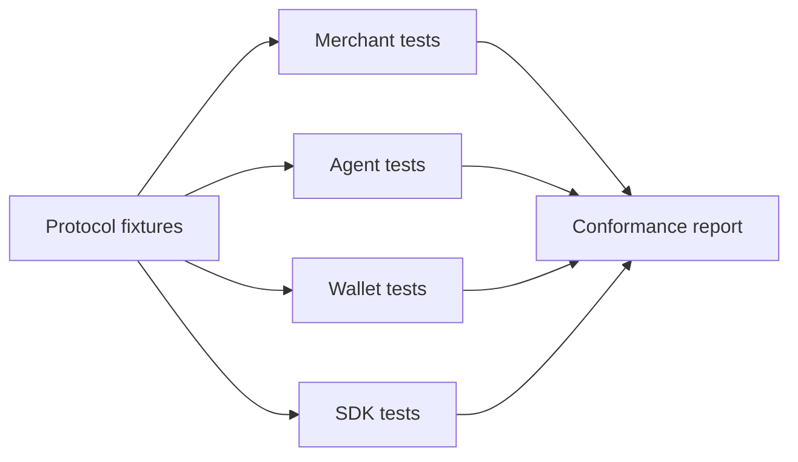

# Conformance

Conformance defines what it means for a merchant, agent, wallet, or SDK to correctly implement AIFP.

## Compatibility Matrix

| Implementer | Must Support | Should Support |
|---|---|---|
| Merchant | 402 challenge, pricing tier, receipt verification, replay rejection | Webhooks, sandbox fixtures, route-level pricing |
| Agent | Detect 402, request quote, pay, retry with receipt, enforce budgets | Agent Passport, merchant allow/deny policy |
| Wallet | Budget checks, approved assets, settlement references | Multi-rail settlement, risk rules, spending windows |
| SDK | Typed protocol objects, errors, receipt helpers | Framework middleware, generated clients, test fixtures |

## Future Certification Suite

## Minimum Test Areas

- HTTP 402 challenge shape.
- Quote creation and expiry.
- Payment idempotency.
- Receipt signature verification.
- Resource and audience binding.
- Nonce replay rejection.
- Pricing tier consistency.
- Error registry compatibility.
- Webhook signature verification.
- JWKS key rotation behavior.

