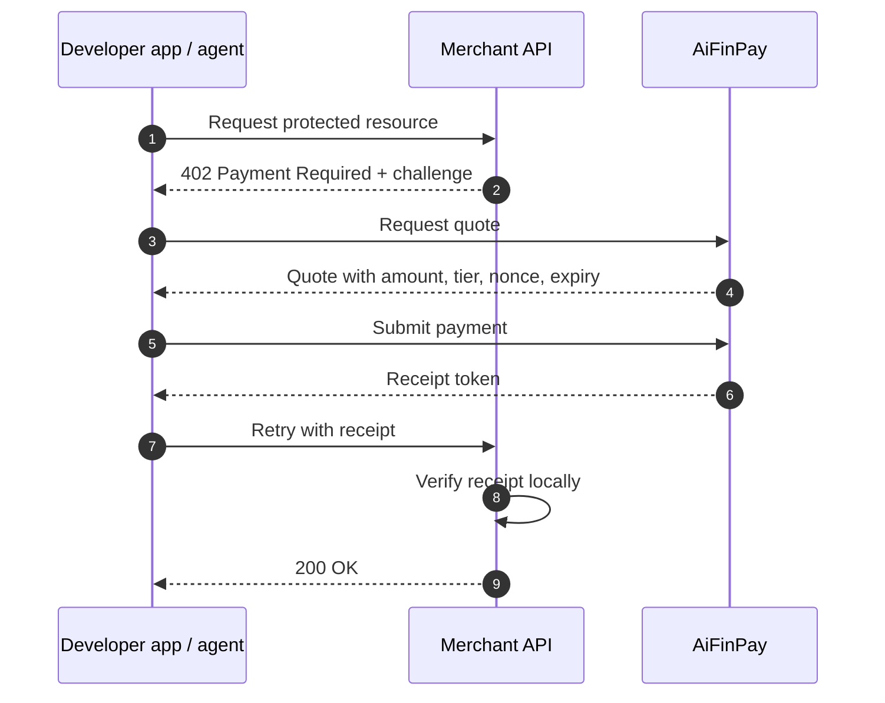

# x402 Flow

The x402 flow is the payment handshake that turns a protected HTTP request into a paid retry.
It starts when a merchant returns `402 Payment Required` and ends when the merchant verifies a
receipt locally and serves the original resource.

## Terms

| Term | Meaning |
|---|---|
| `402 Payment Required` | An HTTP status that says the resource is available after payment |
| Payment challenge | The machine-readable payload that explains what to pay, where to pay, and how long the offer is valid |
| Quote | A binding price for a specific resource and tier |
| Receipt token | A signed proof of payment, usually a JWT signed with Ed25519 |
| Nonce | A single-use random value that prevents replay |
| JWKS | JSON Web Key Set, the merchant-facing key set used to verify receipts |

## The Loop

## What Happens Under The Hood

1. The merchant chooses a pricing tier and returns a challenge instead of serving the resource.
2. The client asks for a quote and receives the exact price, resource scope, and expiry.
3. The client pays through AiFinPay and receives a signed receipt token.
4. The merchant verifies signature, audience, resource, amount, expiry, and nonce locally, then serves the request.

For the full developer path, use [Quick Start](../quickstart/index.md).

## Related Docs

- [Pricing](../economics.md)
- [Security Model](../security-model.md)
- [Error Codes](../reference/error-codes.md)
