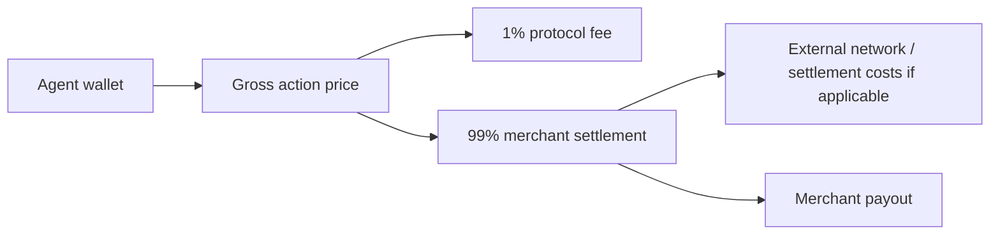

# Protocol Economics

AiFinPay prices agent work as small, explicit, resource-scoped actions. The merchant controls the action tier. The agent controls wallet policy and budget approval.

## Action Pricing

| Tier | Starts From | Workload | Examples |
|---|---:|---|---|
| `standard` | `$0.00001` | Simple read, single record, lightweight API request | Profile lookup, status read, single-row retrieval |
| `complex` | `$0.00006` | Search, aggregation, multi-source queries, higher compute | Search API, analytics aggregation, multi-source enrichment |
| `premium` | `$0.00010` | AI inference, GPU workloads, deep analytics, premium data | LLM inference, premium data feed, GPU analytics job |

## Fee Rule

| Rule | Value |
|---|---|
| AiFinPay Protocol Fee | 1% of every successful transaction |
| Merchant settlement | 99% before external network or settlement costs |
| External costs | Gas, processor, payout, FX, or settlement rail costs may apply separately |
| Failed payment | No successful transaction fee |
| Receipt verification | Merchant verifies locally without a per-request control-plane call |

## Settlement Flow

## Design Principles

- Prices should be discoverable before payment.
- Receipts should bind amount, merchant, resource, expiry, and nonce.
- Merchants should not have to run payment logic inside every protected route.
- Agents should be able to enforce budgets before payment.
- The protocol should work for tiny actions without introducing a native token.

