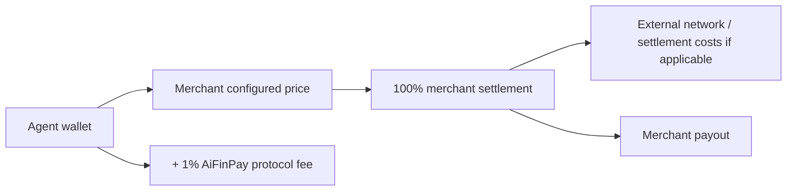

# Protocol Economics

AiFinPay prices agent work as small, explicit, resource-scoped actions. The merchant controls the action tier and may set higher prices. The agent controls wallet policy and budget approval.

## Action Pricing

| Tier | Starts From | Workload | Examples |
|---|---:|---|---|
| `standard` | `$0.0005` | Simple read, single record, lightweight API request | Profile lookup, status read, single-row retrieval |
| `complex` | `$0.002` | Search, aggregation, multi-source queries, higher compute | Search API, analytics aggregation, multi-source enrichment |
| `premium` | `$0.005` | AI inference, GPU workloads, deep analytics, premium data | LLM inference, premium data feed, GPU analytics job |

These are protocol reference floors, not mandatory merchant retail prices. A merchant can charge more for an action, content object, API product, subscription, premium data, or other digital service.

## Fee Rule

| Rule | Value |
|---|---|
| AiFinPay Protocol Fee | 1% of the merchant-configured successful transaction amount |
| Fee model | **Fee-on-top** |
| Merchant settlement | 100% of the merchant-configured action price before external network or settlement costs |
| Agent debit | Merchant price + 1% AiFinPay protocol fee + any explicitly disclosed external costs |
| External costs | Gas, processor, payout, FX, or settlement rail costs may apply separately |
| Failed payment | No successful transaction fee |
| Receipt verification | Merchant verifies locally without a per-request control-plane call |

The 1% AiFinPay fee MUST NOT be silently deducted from the merchant's configured price. Implementations MUST calculate the fee separately and disclose the full amount to the paying agent before authorization.

## Settlement Flow

```mermaid
flowchart LR
    Agent["Agent wallet"] --> MerchantPrice["Merchant configured price"]
    Agent --> Fee["+ 1% AiFinPay protocol fee"]
    MerchantPrice --> Merchant["100% merchant settlement"]
    Merchant --> Costs["External network / settlement costs if applicable"]
    Merchant --> Payout["Merchant payout"]
```

## Security And Accounting Invariants

- The receipt MUST bind the merchant price, protocol fee, total authorized amount, merchant, resource, asset/network, expiry, and replay identifier.
- A wallet MUST authorize the **total debit**, not only the merchant amount.
- Unknown price, fee, asset decimals, deployment address, or settlement state MUST fail closed for autonomous payment.
- Settlement implementations MUST use exact integer base units and MUST NOT rely on floating-point arithmetic for on-chain values.
- The production support matrix MUST list only payment rails with reproducible E2E evidence against the canonical deployment registry.

## Design Principles

- Prices should be discoverable before payment.
- Merchants should receive the price they configured.
- Receipts should bind amount, merchant, resource, expiry, and replay identifiers.
- Merchants should not have to run payment logic inside every protected route.
- Agents should be able to enforce budgets before payment.
- The protocol should work for tiny actions without introducing a native token.
