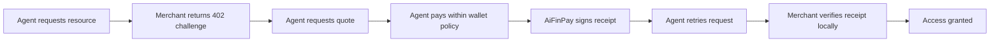

# AiFinPay Documentation Portal

Welcome to the AiFinPay Paywall documentation portal. This is the public entry point for protocol implementers, merchant engineers, AI-agent builders, wallet teams, and ecosystem contributors.

## Start Here

| Role | Recommended Path | Outcome |
|---|---|---|
| New developer | [Quick Start](quickstart/index.md) | Understand the end-to-end HTTP 402 flow |
| Merchant engineer | [Merchant Guide](merchant.md) -> [Integration Guide](aifp/02-Merchant-Integration-Guide.md) | Protect a route and verify receipts |
| Agent builder | [Agent Guide](agent.md) -> [Agent SDK Spec](aifp/03-AI-Agent-SDK-Specification.md) | Pay automatically within budget policy |
| Wallet/platform engineer | [Wallet Guide](wallet.md) -> [Security Spec](aifp/04-Security-and-Cryptography-Specification.md) | Bind wallets and enforce settlement policy |
| Protocol implementer | [AIFP-1 RFC](aifp/01-AIFP-1-RFC-Payment-Protocol-Specification.md) | Implement the normative protocol |
| API tooling | [OpenAPI 3.1](aifp/08-OpenAPI-3.1-Specification.yaml) + [JSON Schemas](aifp/10-JSON-Schemas.md) | Generate clients and validators |
| Maintainer | [Repository Architecture](aifp/15-Repository-Architecture.md) + [AIP Process](aifp/06-AIP-Improvement-Proposal-Process.md) | Evolve the project safely |

## Documentation Sections

| Section | Description |
|---|---|
| [Architecture](architecture.md) | System model, trust boundaries, data plane, control plane |
| [Core Concepts](core-concepts/index.md) | x402 flow, pricing, security, and conformance |
| [Protocol Economics](economics.md) | Pricing tiers, protocol fee, merchant settlement model |
| [Security Model](security-model.md) | Receipt signing, replay prevention, wallet policy, key rotation |
| [Conformance](conformance.md) | Compatibility matrix and future certification plan |
| [Developer Experience](developer-experience.md) | SDKs, examples, sandbox, OpenAPI, Postman, schemas |
| [Quick Start](quickstart/index.md) | Sandbox-first Node, Python, and MCP onboarding |
| [Navigation](navigation.md) | Complete documentation map |
| [AIFP Docs](aifp/README.md) | Canonical documentation package |
| [SDKs](../sdk/README.md) | SDK package strategy and language matrix |
| [Examples](../examples/README.md) | Runnable examples and recipes |
| [Sandbox](../sandbox/README.md) | Development and testing environment |
| [Schemas](../schemas/README.md) | Validation and machine-readable contracts |
| [Reference](reference/index.md) | Error codes and low-level protocol reference |

## Protocol In One Flow

## Canonical Documents

The canonical documentation package lives in [`docs/aifp/`](aifp/README.md). These documents govern protocol behavior and should be treated as source of truth.

