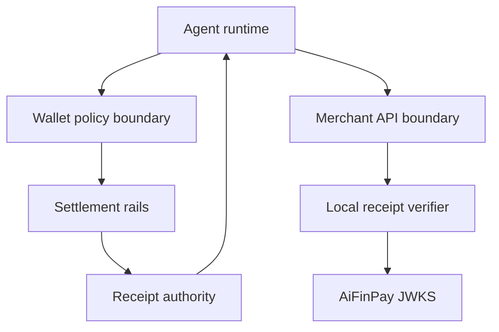

# Security Model

AiFinPay treats payment receipts as short-lived cryptographic capabilities scoped to a merchant and resource.

## Trust Boundaries

## Required Receipt Checks

| Check | Requirement |
|---|---|
| Signature | Verify EdDSA / Ed25519 with the advertised `kid` |
| Issuer | Must be a trusted AiFinPay receipt authority |
| Audience | Must match the merchant id |
| Resource | Must match the protected resource or canonical route pattern |
| Amount | Must meet or exceed the required action price |
| Pricing tier | Must match the merchant pricing decision for the resource |
| Expiry | Default receipt TTL is short-lived; expired receipts are rejected |
| Nonce | Nonces are single-use to prevent replay |
| Idempotency | Payment calls use idempotency keys to avoid duplicate charges |

## Operational Controls

- Rotate signing keys through JWKS and keep old keys available for the maximum receipt TTL.
- Log receipt id, merchant id, resource, amount, and verification decision.
- Never log private wallet keys or full bearer credentials.
- Treat webhook verification as mandatory before mutating merchant state.
- Fail closed on signature, audience, resource, amount, or expiry mismatch.

See the canonical [Security and Cryptography Specification](aifp/04-Security-and-Cryptography-Specification.md).

