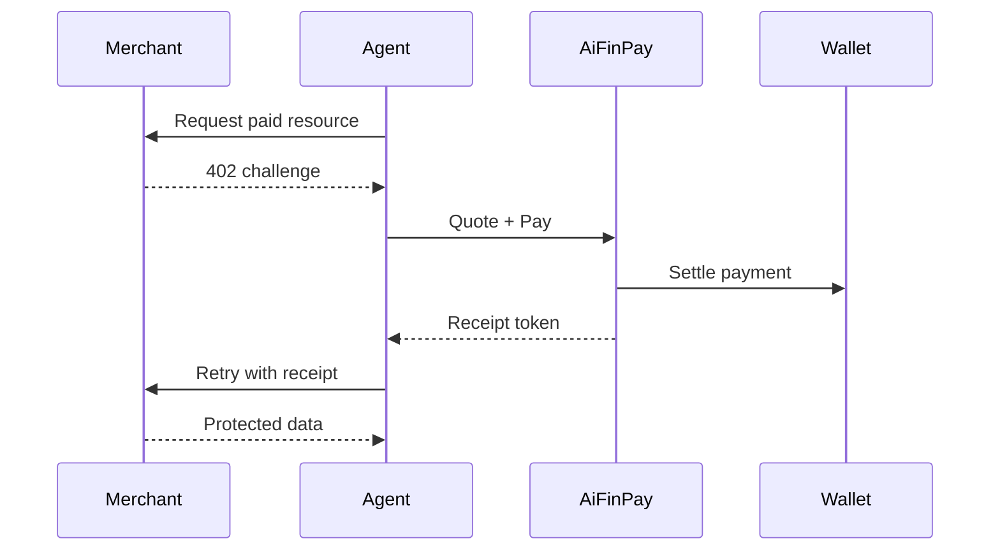

# Examples

Examples show the canonical AIFP flow from multiple perspectives.

## Example Catalog

| Example | Purpose |
|---|---|
| [`merchant-basic.md`](merchant-basic.md) | Protect a resource with AIFP middleware |
| [`agent-autopay.md`](agent-autopay.md) | Agent detects `402`, pays, and retries |
| [`wallet-funding.md`](wallet-funding.md) | Wallet setup and budget policy |
| [`webhook-verification.md`](webhook-verification.md) | Merchant verifies signed webhooks |

## End-to-End Flow

Examples are illustrative and must remain aligned with `docs/aifp/08-OpenAPI-3.1-Specification.yaml` and `docs/aifp/10-JSON-Schemas.md`.
