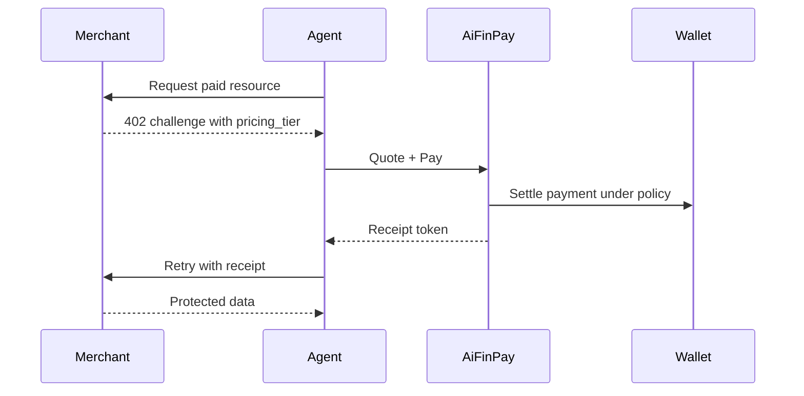

# Examples

Examples show the canonical AIFP flow from multiple perspectives. They are written as copyable implementation recipes and must remain aligned with OpenAPI, JSON Schemas, and AIFP-1.

## Example Catalog

| Example | Purpose |
|---|---|
| [Merchant Basic](merchant-basic.md) | Protect a resource with AIFP middleware |
| [Agent Autopay](agent-autopay.md) | Agent detects `402`, pays, and retries |
| [Wallet Funding](wallet-funding.md) | Wallet setup and budget policy |
| [Webhook Verification](webhook-verification.md) | Merchant verifies signed webhooks |
| [Raw HTTP 402](curl-http-402.md) | End-to-end cURL flow for quote, pay, retry |
| [Receipt Verification](receipt-verification.md) | Local receipt validation checklist and pseudocode |

## End-to-End Flow

## Pricing Contract

All examples use:

| Tier | From |
|---|---:|
| `standard` | `$0.00001` |
| `complex` | `$0.00006` |
| `premium` | `$0.00010` |

Protocol fee is 1%; merchant settlement is 99% before external costs.

