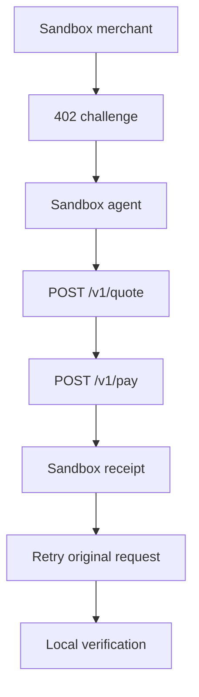

# Sandbox

The AiFinPay sandbox is used to test challenge, quote, pay, receipt, retry, and webhook flows without moving real funds.

## Sandbox URLs

| Environment | URL |
|---|---|
| API | `https://sandbox.api.aifinpay.io` |
| Docs | `https://docs.aifinpay.io` |
| Production API | `https://api.aifinpay.io` |

## Sandbox Flow

## Test Cases

| Case | Expected Result |
|---|---|
| Valid receipt | `200 OK` |
| Expired receipt | `422` or configured protocol error |
| Replayed nonce | `409 Conflict` |
| Budget exceeded | `403 AIFP-403-BUDGET-EXCEEDED` |
| Async settlement | `202`, then receipt polling |
