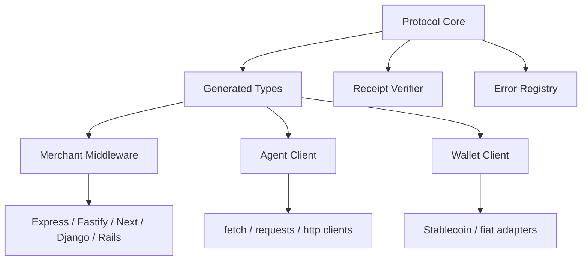

# SDKs

AiFinPay SDKs provide merchant middleware, agent auto-pay clients, receipt verification, wallet binding, and protocol helpers.

## Language Matrix

| Language | Merchant SDK | Agent SDK | Package Target |
|---|---:|---:|---|
| TypeScript / Node | Yes | Yes | `@aifinpay/merchant`, `@aifinpay/agent` |
| Python | Yes | Yes | `aifinpay-merchant`, `aifinpay-agent` |
| Go | Yes | Yes | `github.com/aifinpay/aifp-go` |
| Rust | Planned | Planned | `aifinpay` |
| Java | Planned | Planned | `io.aifinpay:aifp` |
| PHP | Planned | Planned | `aifinpay/aifp` |
| .NET | Planned | Planned | `AiFinPay` |

## SDK Architecture

## Source Documents

- [AI Agent SDK Specification](../docs/aifp/03-AI-Agent-SDK-Specification.md)
- [SDK Reference](../docs/aifp/11-SDK-Reference.md)
- [OpenAPI 3.1](../docs/aifp/08-OpenAPI-3.1-Specification.yaml)
- [JSON Schemas](../docs/aifp/10-JSON-Schemas.md)
