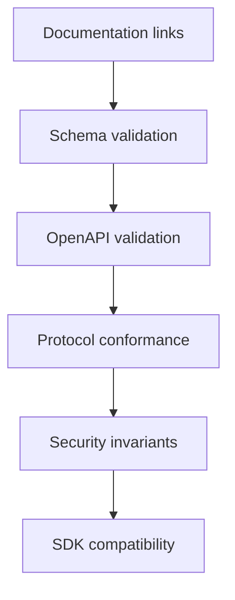

# Tests

AIFP tests should prove protocol conformance, schema correctness, security invariants, and documentation integrity.

## Test Layers

## Required Test Categories

| Category | What It Protects |
|---|---|
| Receipt verification | Signature, issuer, audience, resource, amount, expiry, nonce |
| Replay protection | Reused nonce rejected with conflict |
| Idempotency | `/pay` does not double-charge |
| Error registry | Stable protocol errors |
| OpenAPI | Request/response compatibility |
| JSON Schemas | Object shape compatibility |
| Docs links | Discoverability and public-release quality |
